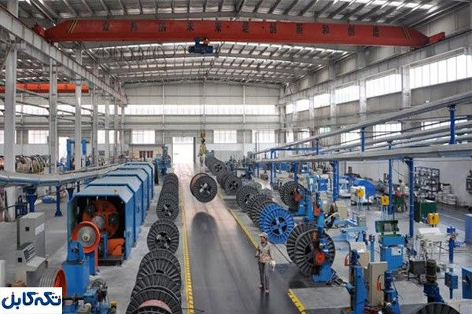
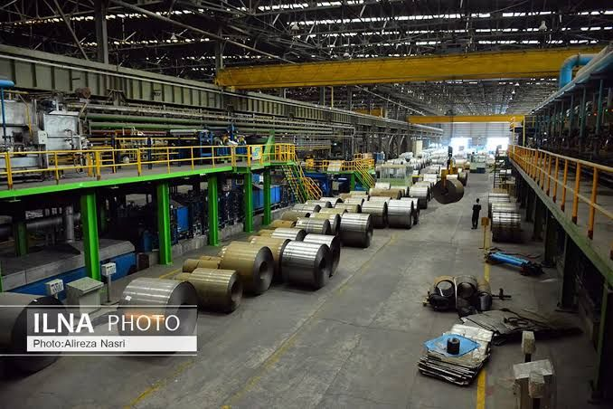

```html
<!DOCTYPE html>
<html lang="fa" dir="rtl">
<head>
<meta charset="UTF-8">
<meta name="viewport" content="width=device-width, initial-scale=1.0">

<title>Mohsen Nasri | Industrial Engineering</title>

<meta name="description"
content="وب‌سایت شخصی و حرفه‌ای مهندس محسن نصری در زمینه مهندسی مکانیک، ماشین‌آلات صنعتی، شیشه، فولاد، کابل و تجهیزات صنعتی.">

<style>

*{
    margin:0;
    padding:0;
    box-sizing:border-box;
}

html{
    scroll-behavior:smooth;
}

body{
    font-family:
        Tahoma,
        Arial,
        sans-serif;
    background:#071018;
    color:#fff;
    line-height:1.8;
    overflow-x:hidden;
}

/* =========================
   GLOBAL
========================= */

a{
    color:inherit;
    text-decoration:none;
}

section{
    position:relative;
}

.container{
    width:min(1200px,92%);
    margin:auto;
}

.section-title{
    text-align:center;
    margin-bottom:55px;
}

.section-title h2{
    font-size:clamp(28px,4vw,44px);
    margin-bottom:12px;
    color:#fff;
}

.section-title p{
    color:#aab7c4;
    font-size:16px;
}

/* =========================
   NAVBAR
========================= */

.navbar{
    position:fixed;
    top:0;
    right:0;
    left:0;
    z-index:1000;

    background:rgba(4,10,16,.78);
    backdrop-filter:blur(14px);

    border-bottom:1px solid rgba(255,255,255,.08);
}

.nav-inner{
    width:min(1250px,94%);
    margin:auto;

    min-height:75px;

    display:flex;
    align-items:center;
    justify-content:space-between;
    gap:30px;
}

.logo{
    font-size:21px;
    font-weight:800;
    letter-spacing:.5px;
    white-space:nowrap;
}

.logo span{
    color:#f4a62a;
}

.nav-links{
    display:flex;
    align-items:center;
    gap:28px;
    list-style:none;
}

.nav-links a{
    color:#dce4ea;
    font-size:14px;
    transition:.3s;
}

.nav-links a:hover{
    color:#f4a62a;
}

.nav-button{
    padding:10px 19px;
    border:1px solid #f4a62a;
    border-radius:8px;
    color:#f4a62a !important;
}

/* =========================
   HERO
========================= */

.hero{
    min-height:100vh;
    width:100%;

    display:flex;
    align-items:center;

    position:relative;

    background-image:
        linear-gradient(
            90deg,
            rgba(3,10,15,.93) 0%,
            rgba(3,10,15,.72) 42%,
            rgba(3,10,15,.25) 100%
        ),
        url("industrial-hero.png");

    background-size:cover;
    background-position:center;
    background-repeat:no-repeat;
}

.hero::after{
    content:"";
    position:absolute;
    inset:0;

    background:
        linear-gradient(
            180deg,
            rgba(0,0,0,.25),
            transparent 45%,
            rgba(3,9,14,.8)
        );

    pointer-events:none;
}

.hero-content{
    position:relative;
    z-index:2;

    width:min(1200px,92%);
    margin:auto;

    padding-top:75px;
}

.hero-text{
    max-width:720px;
}

.hero-tag{
    display:inline-block;

    padding:8px 15px;
    margin-bottom:22px;

    border:1px solid rgba(244,166,42,.55);
    border-radius:30px;

    background:rgba(0,0,0,.3);

    color:#f4a62a;
    font-size:14px;
}

.hero h1{
    font-size:clamp(42px,7vw,82px);
    line-height:1.15;
    margin-bottom:22px;
    font-weight:900;
}

.hero h1 span{
    color:#f4a62a;
}

.hero h2{
    font-size:clamp(20px,3vw,30px);
    color:#dce5ec;
    margin-bottom:20px;
    font-weight:500;
}

.hero p{
    color:#bdc8d1;
    max-width:650px;
    font-size:17px;
    margin-bottom:35px;
}

.hero-buttons{
    display:flex;
    flex-wrap:wrap;
    gap:15px;
}

.btn{
    display:inline-flex;
    align-items:center;
    justify-content:center;

    padding:13px 27px;

    border-radius:8px;

    font-weight:bold;
    font-size:15px;

    transition:.3s;
}

.btn-primary{
    background:#f4a62a;
    color:#081017;
}

.btn-primary:hover{
    transform:translateY(-3px);
    box-shadow:0 12px 30px rgba(244,166,42,.25);
}

.btn-secondary{
    border:1px solid rgba(255,255,255,.3);
    background:rgba(255,255,255,.06);
}

.btn-secondary:hover{
    border-color:#f4a62a;
    color:#f4a62a;
}

.scroll-down{
    position:absolute;
    bottom:28px;
    left:50%;
    transform:translateX(-50%);

    z-index:3;

    color:#aab7c4;
    font-size:13px;
}

.scroll-down::after{
    content:"↓";
    display:block;
    text-align:center;
    font-size:25px;
    color:#f4a62a;
}

/* =========================
   ABOUT
========================= */

.about{
    padding:110px 0;
    background:#09141d;
}

.about-grid{
    display:grid;
    grid-template-columns:1fr 1fr;
    gap:55px;
    align-items:center;
}

.about-text h3{
    font-size:32px;
    margin-bottom:20px;
}

.about-text h3 span{
    color:#f4a62a;
}

.about-text p{
    color:#aebbc5;
    margin-bottom:18px;
}

.about-boxes{
    display:grid;
    grid-template-columns:1fr 1fr;
    gap:18px;
}

.about-box{
    padding:27px;
    border:1px solid rgba(255,255,255,.08);
    border-radius:12px;
    background:rgba(255,255,255,.035);
    transition:.3s;
}

.about-box:hover{
    transform:translateY(-5px);
    border-color:rgba(244,166,42,.4);
}

.about-box strong{
    display:block;
    color:#f4a62a;
    font-size:28px;
    margin-bottom:5px;
}

.about-box span{
    color:#aab7c4;
    font-size:14px;
}

/* =========================
   INDUSTRIES
========================= */

.industries{
    padding:110px 0;
    background:#071018;
}

.industry-grid{
    display:grid;
    grid-template-columns:repeat(5,1fr);
    gap:18px;
}

.industry-card{
    height:390px;
    position:relative;
    overflow:hidden;

    border-radius:14px;

    border:1px solid rgba(255,255,255,.09);

    background:#111;

    transition:.4s;
}

.industry-card:hover{
    transform:translateY(-9px);
    border-color:#f4a62a;
    box-shadow:0 20px 50px rgba(0,0,0,.35);
}

.industry-card img{
    width:100%;
    height:100%;
    object-fit:cover;

    transition:.6s;
}

.industry-card:hover img{
    transform:scale(1.09);
}

.industry-overlay{
    position:absolute;
    inset:0;

    display:flex;
    align-items:flex-end;

    padding:22px;

    background:
        linear-gradient(
            transparent 30%,
            rgba(0,0,0,.9)
        );
}

.industry-info{
    width:100%;
}

.industry-info h3{
    font-size:20px;
    margin-bottom:7px;
}

.industry-info p{
    font-size:12px;
    color:#c2ccd3;
    margin-bottom:13px;
}

.industry-link{
    display:inline-block;

    padding:7px 13px;

    border:1px solid rgba(244,166,42,.6);
    border-radius:6px;

    color:#f4a62a;
    font-size:12px;

    transition:.3s;
}

.industry-card:hover .industry-link{
    background:#f4a62a;
    color:#071018;
}

/* =========================
   SERVICES
========================= */

.services{
    padding:110px 0;
    background:#0a151e;
}

.services-grid{
    display:grid;
    grid-template-columns:repeat(3,1fr);
    gap:22px;
}

.service{
    padding:35px 30px;

    border-radius:14px;

    background:#0e1c27;

    border:1px solid rgba(255,255,255,.07);

    transition:.35s;
}

.service:hover{
    transform:translateY(-7px);
    border-color:rgba(244,166,42,.5);
}

.service-number{
    color:#f4a62a;
    font-size:14px;
    margin-bottom:20px;
}

.service h3{
    font-size:21px;
    margin-bottom:13px;
}

.service p{
    color:#aab7c4;
    font-size:14px;
}

/* =========================
   PROJECTS
========================= */

.projects{
    padding:110px 0;
    background:#071018;
}

.project-grid{
    display:grid;
    grid-template-columns:repeat(3,1fr);
    gap:22px;
}

.project{
    padding:30px;

    min-height:230px;

    border-radius:14px;

    background:
        linear-gradient(
            145deg,
            #101f2a,
            #09131c
        );

    border:1px solid rgba(255,255,255,.08);
}

.project h3{
    margin-bottom:13px;
    color:#fff;
}

.project p{
    color:#aab7c4;
    font-size:14px;
}

/* =========================
   QUESTIONS
========================= */

.questions{
    padding:110px 0;
    background:#0a151e;
}

.question-box{
    max-width:850px;
    margin:auto;

    padding:40px;

    border-radius:15px;

    background:#0d1b26;

    border:1px solid rgba(255,255,255,.08);
}

.question-box p{
    color:#aab7c4;
    margin-bottom:25px;
}

.question-form{
    display:grid;
    gap:15px;
}

.question-form input,
.question-form textarea{
    width:100%;

    padding:14px 16px;

    border-radius:8px;

    border:1px solid rgba(255,255,255,.12);

    background:#071018;

    color:#fff;

    font-family:inherit;

    outline:none;
}

.question-form input:focus,
.question-form textarea:focus{
    border-color:#f4a62a;
}

.question-form textarea{
    min-height:150px;
    resize:vertical;
}

.question-form button{
    border:0;
    cursor:pointer;
    font-family:inherit;
}

/* =========================
   CONTACT
========================= */

.contact{
    padding:90px 0;
    background:#050c12;
}

.contact-inner{
    text-align:center;
}

.contact-inner h2{
    font-size:36px;
    margin-bottom:15px;
}

.contact-inner p{
    color:#aab7c4;
    margin-bottom:30px;
}

/* =========================
   FOOTER
========================= */

footer{
    padding:25px 0;

    background:#03080c;

    border-top:1px solid rgba(255,255,255,.06);

    text-align:center;

    color:#788692;

    font-size:13px;
}

/* =========================
   MOBILE
========================= */

@media(max-width:1050px){

    .industry-grid{
        grid-template-columns:repeat(3,1fr);
    }

}

@media(max-width:800px){

    .nav-links{
        display:none;
    }

    .hero{
        background-position:center;
    }

    .hero-content{
        padding-top:100px;
    }

    .hero h1{
        font-size:48px;
    }

    .about-grid{
        grid-template-columns:1fr;
    }

    .services-grid,
    .project-grid{
        grid-template-columns:1fr 1fr;
    }

    .industry-grid{
        grid-template-columns:1fr 1fr;
    }

}

@media(max-width:550px){

    .hero{
        min-height:100svh;
    }

    .hero h1{
        font-size:40px;
    }

    .hero h2{
        font-size:21px;
    }

    .hero p{
        font-size:15px;
    }

    .hero-buttons{
        flex-direction:column;
        align-items:stretch;
    }

    .btn{
        width:100%;
    }

    .about-boxes{
        grid-template-columns:1fr;
    }

    .services-grid,
    .project-grid,
    .industry-grid{
        grid-template-columns:1fr;
    }

    .industry-card{
        height:330px;
    }

    .question-box{
        padding:25px;
    }

    .logo{
        font-size:18px;
    }

}

</style>
</head>

<body>

<!-- =========================
     NAVIGATION
========================= -->

<nav class="navbar">

<div class="nav-inner">

<a href="#home" class="logo">
Mohsen <span>Nasri</span>
</a>

<ul class="nav-links">

<li>
<a href="#home">خانه</a>
</li>

<li>
<a href="#about">درباره من</a>
</li>

<li>
<a href="#industries">صنایع</a>
</li>

<li>
<a href="#services">خدمات</a>
</li>

<li>
<a href="#projects">پروژه‌ها</a>
</li>

<li>
<a href="#questions">پرسش و پاسخ</a>
</li>

<li>
<a href="#contact" class="nav-button">ارتباط با من</a>
</li>

</ul>

</div>

</nav>


<!-- =========================
     HERO
========================= -->

<section class="hero" id="home">

<div class="hero-content">

<div class="hero-text">

<div class="hero-tag">
Industrial Engineering
</div>

<h1>
محسن <span>نصری</span>
</h1>

<h2>
مهندسی مکانیک و مهندسی صنعتی
</h2>

<p>
تخصص در ماشین‌آلات صنعتی، سیستم‌های مکانیکی،
تجهیزات تولید، صنایع شیشه، فولاد، کابل و
فرآیندهای صنعتی.
</p>

<div class="hero-buttons">

<a href="#industries" class="btn btn-primary">
مشاهده صنایع
</a>

<a href="#about" class="btn btn-secondary">
درباره من
</a>

</div>

</div>

</div>

<div class="scroll-down">
برای مشاهده ادامه صفحه
</div>

</section>


<!-- =========================
     ABOUT
========================= -->

<section class="about" id="about">

<div class="container">

<div class="section-title">

<h2>درباره من</h2>

<p>
تجربه و دانش مهندسی در محیط‌های صنعتی
</p>

</div>

<div class="about-grid">

<div class="about-text">

<h3>
مهندسی برای <span>صنعت واقعی</span>
</h3>

<p>
من محسن نصری، مهندس مکانیک با تمرکز بر
ماشین‌آلات و تجهیزات صنعتی هستم.
</p>

<p>
فعالیت حرفه‌ای من بر شناخت، تحلیل، نصب،
راه‌اندازی و کار با سیستم‌های مکانیکی و
ماشین‌آلات خطوط تولید صنعتی متمرکز است.
</p>

<p>
هدف این وب‌سایت ارائه تجربه‌ها، پروژه‌ها،
دانش فنی و زمینه‌های تخصصی فعالیت من در
صنایع مختلف است.
</p>

</div>

<div class="about-boxes">

<div class="about-box">
<strong>01</strong>
<span>مهندسی مکانیک</span>
</div>

<div class="about-box">
<strong>02</strong>
<span>ماشین‌آلات صنعتی</span>
</div>

<div class="about-box">
<strong>03</strong>
<span>راه‌اندازی تجهیزات</span>
</div>

<div class="about-box">
<strong>04</strong>
<span>مستندسازی فنی</span>
</div>

</div>

</div>

</div>

</section>


<!-- =========================
     INDUSTRIES
========================= -->

<section class="industries" id="industries">

<div class="container">

<div class="section-title">

<h2>زمینه‌های صنعتی</h2>

<p>
تجربه و فعالیت در صنایع مختلف
</p>

</div>

<div class="industry-grid">


<a href="rewinding.html" class="industry-card">


<div class="industry-overlay">

<div class="industry-info">

<h3>سیم‌پیچی</h3>

<p>
ماشین‌آلات و تجهیزات صنعتی سیم‌پیچی
</p>

<span class="industry-link">
مشاهده
</span>

</div>

</div>

</a>


<a href="float-glass.html" class="industry-card">


<div class="industry-overlay">

<div class="industry-info">

<h3>شیشه فلوت و تخت</h3>

<p>
تجهیزات و ماشین‌آلات صنعت شیشه
</p>

<span class="industry-link">
مشاهده
</span>

</div>

</div>

</a>


<a href="cable.html" class="industry-card">



<div class="industry-overlay">

<div class="industry-info">

<h3>کابل‌سازی</h3>

<p>
ماشین‌آلات خطوط تولید کابل
</p>

<span class="industry-link">
مشاهده
</span>

</div>

</div>

</a>


<a href="steel.html" class="industry-card">



<div class="industry-overlay">

<div class="industry-info">

<h3>فولاد</h3>

<p>
تجهیزات و ماشین‌آلات صنایع فولاد
</p>

<span class="industry-link">
مشاهده
</span>

</div>

</div>

</a>


<a href="container-glass.html" class="industry-card">


<div class="industry-overlay">

<div class="industry-info">

<h3>شیشه بطری</h3>

<p>
ماشین‌آلات تولید ظروف شیشه‌ای
</p>

<span class="industry-link">
مشاهده
</span>

</div>

</div>

</a>


</div>

</div>

</section>


<!-- =========================
     SERVICES
========================= -->

<section class="services" id="services">

<div class="container">

<div class="section-title">

<h2>خدمات تخصصی</h2>

<p>
زمینه‌های اصلی خدمات مهندسی
</p>

</div>

<div class="services-grid">

<div class="service">

<div class="service-number">
01
</div>

<h3>
مهندسی مکانیک
</h3>

<p>
تحلیل و بررسی تجهیزات مکانیکی،
ماشین‌آلات و سیستم‌های صنعتی.
</p>

</div>


<div class="service">

<div class="service-number">
02
</div>

<h3>
ماشین‌آلات صنعتی
</h3>

<p>
بررسی ساختار، عملکرد و سیستم‌های
ماشین‌آلات خطوط تولید.
</p>

</div>


<div class="service">

<div class="service-number">
03
</div>

<h3>
نصب و راه‌اندازی
</h3>

<p>
همراهی فنی در نصب، راه‌اندازی و
آماده‌سازی تجهیزات صنعتی.
</p>

</div>


<div class="service">

<div class="service-number">
04
</div>

<h3>
مستندات فنی
</h3>

<p>
تهیه و تدوین مستندات، دستورالعمل‌ها
و اطلاعات فنی تجهیزات.
</p>

</div>


<div class="service">

<div class="service-number">
05
</div>

<h3>
تحلیل تجهیزات
</h3>

<p>
بررسی ساختار و عملکرد سیستم‌های
مکانیکی و صنعتی.
</p>

</div>


<div class="service">

<div class="service-number">
06
</div>

<h3>
آموزش صنعتی
</h3>

<p>
انتقال دانش فنی و آموزش نیروهای
مورد استفاده در محیط صنعتی.
</p>

</div>

</div>

</div>

</section>


<!-- =========================
     PROJECTS
========================= -->

<section class="projects" id="projects">

<div class="container">

<div class="section-title">

<h2>پروژه‌ها</h2>

<p>
نمونه‌ای از حوزه‌های فعالیت حرفه‌ای
</p>

</div>

<div class="project-grid">

<div class="project">

<h3>
ماشین‌های تولید شیشه
</h3>

<p>
بررسی سیستم‌ها و تجهیزات ماشین‌آلات
تولید ظروف شیشه‌ای و سیستم‌های مرتبط.
</p>

</div>


<div class="project">

<h3>
مستندات فنی صنعتی
</h3>

<p>
تهیه و توسعه مستندات تخصصی برای
ماشین‌آلات و تجهیزات صنعتی.
</p>

</div>


<div class="project">

<h3>
تجهیزات مکانیکی
</h3>

<p>
بررسی و تحلیل سیستم‌های مکانیکی
مورد استفاده در خطوط تولید.
</p>

</div>


</div>

</div>

</section>


<!-- =========================
     QUESTIONS
========================= -->

<section class="questions" id="questions">

<div class="container">

<div class="section-title">

<h2>
پرسش و پاسخ
</h2>

<p>
سؤال فنی خود را مطرح کنید
</p>

</div>

<div class="question-box">

<p>
اگر درباره ماشین‌آلات، تجهیزات مکانیکی،
فرآیندهای صنعتی یا موضوعات فنی سؤال دارید،
می‌توانید سؤال خود را ارسال کنید.
</p>

<form
class="question-form"
action="mailto:"
method="post"
enctype="text/plain"
>

<input
type="text"
name="name"
placeholder="نام شما"
required
>

<input
type="email"
name="email"
placeholder="ایمیل"
required
>

<textarea
name="question"
placeholder="سؤال خود را بنویسید..."
required
></textarea>

<button
type="submit"
class="btn btn-primary"
>
ارسال سؤال
</button>

</form>

</div>

</div>

</section>


<!-- =========================
     CONTACT
========================= -->

<section class="contact" id="contact">

<div class="container">

<div class="contact-inner">

<h2>
همکاری و ارتباط
</h2>

<p>
برای پروژه‌های صنعتی، همکاری مهندسی و
موضوعات تخصصی می‌توانید با من در ارتباط باشید.
</p>

<a href="mailto:" class="btn btn-primary">
تماس با من
</a>

</div>

</div>

</section>


<!-- =========================
     FOOTER
========================= -->

<footer>

<div class="container">

© 2026 Mohsen Nasri —
Industrial Engineering

</div>

</footer>


</body>
</html>
```
